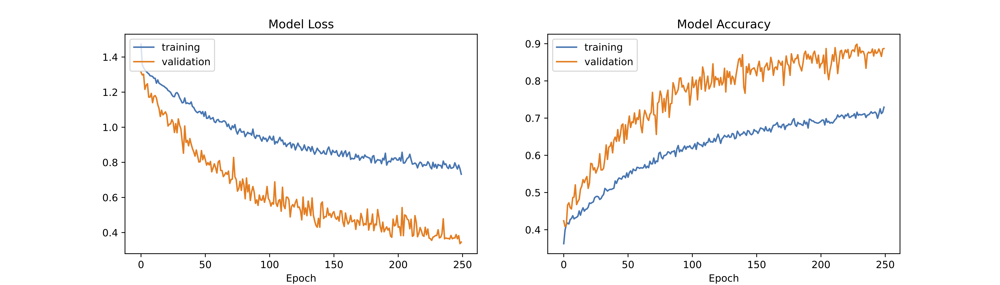

# Language model for sentiment analysis

The goal was to use transfer learning from the BERT model to predict sentiment from sentences. This is a multi-class classification problem using both TensorFlow and Transformers to build a multiclass sentiment classifier.  
I followed the following tutorial: https://www.youtube.com/watch?v=GYDFBfx8Ts8&ab_channel=JamesBriggs  

I used the Rotten Tomatoes movie review dataset from Kaggle (https://www.kaggle.com/c/sentiment-analysis-on-movie-reviews).   
The Rotten Tomatoes movie review dataset is a corpus of movie reviews used for sentiment analysis, originally collected by Pang and Lee. In their work on sentiment treebanks, Socher et al. used Amazon's Mechanical Turk to create fine-grained labels for all parsed phrases in the corpus. This competition presents a chance to benchmark your sentiment-analysis ideas on the Rotten Tomatoes dataset. You are asked to label phrases on a scale of five values: negative, somewhat negative, neutral, somewhat positive, positive. Obstacles like sentence negation, sarcasm, terseness, language ambiguity, and many others make this task very challenging.

Steps:  
1 - Download and preprocess Data  
2 - Initializing hugging face (transformers framework) Tokenizer and Model  
3 - Encode Input Data  
4 - Build Model architecture (Input layers --> BERT output layers)  
5 - Optimizers, Metrics and Loss  
6 - Training

## Conda environment

```
conda create -n Practice_tf_gpu tensorflow-gpu matplotlib ipykernel pandas seaborn keras-gpu python=3.7
conda activate Practice_tf_gpu
pip install kaggle
pip install transformers
```

## Code
Jupyter notebook with the different steps: BERT_sent_classification.ipynb  
Python script to run model from terminal: BERT_sent_classification.py  


## Predict the sentiment of a sentence using final model

```
python ./Predict_sentiment.py "I love it" "I hate it" "You are great" "It had a very interesting story but I did not like the actors" "I feel ashamed"
```